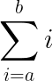
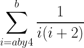

```lisp
(define (sum-ints a b)
    (if (> a b)
        0
        (+ a
            (sum-ints (1+ a) b))))
```
---
.gif)
```lisp
(define (sqs x)
    (* x x))

(define (sumsqs a b)
    (if (> a b)
        0
        (+ (sqs a)
            (sumsqs (1+ a) b))))
```
---

```lisp
(define (pi-sum a b)
    (if (> a b)
        0
        (+ (/ 1 (* a (+ a 2)))
            (pi-sum (+ a 4) b))))
```
---

Note the general pattern:

```
(define (<name> a b) ; sum procedure being defined, upper bound and lower bound
    (if (> a b) ; lower bound tested to be greater than the upper
        0 ; result zero
        (+ (<term> a) ; otherwise, we're going to do something to the lower bound (index)
            (<name> (<next> a) b)))) ; add that result to the following procedure recursively on the our lower bound incremented by some next operation with the same upper bound
```

Encapsulation of said pattern by higher order function:

```lisp
(define (sum term a next b) ; take 4 args term and next are not numbers, these are procedures
    (if (> a b)
        0
        (+ (term a)
           (sum term ; same procedure, we'll need it again
                (next a) ; next index, using the next procedure to computer it
                next ; the procedure for computing next, which is different from next index
                b)))) ; upper bound
```
---

Sum integers:

```lisp
(define (sum-int a b)
    (define (identity x) x)
    (sum identity a 1+ b))
```

Sum squares:

```lisp
(define (sumSquares a b)
    (sum sqs a 1+ b))
```

Leibnitz (for finding pi over 8):

```lisp
(define (pi-sum a b)
    (sum (lambda (i) (/ 1 (* i (+ 1 2))))
          a
          (lambda (i) (+ i 4))
          b))
```